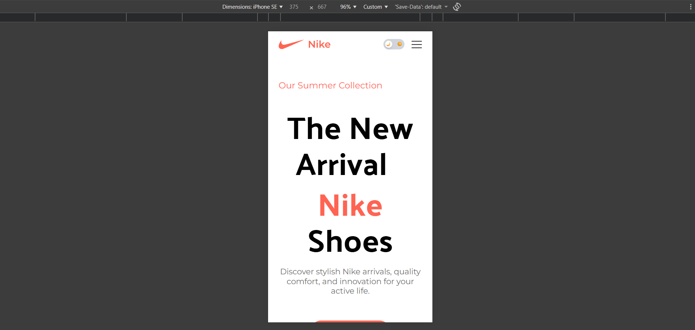
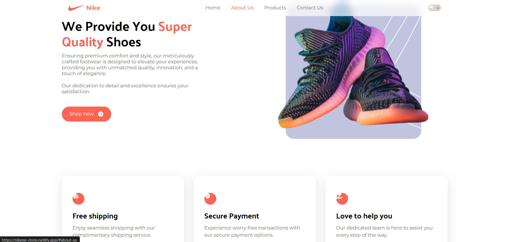

# 👟 Nike-clone (React + Tailwind CSS)

A modern, fully responsive **Nike-inspired landing page** built using **React, Vite, and Tailwind CSS**.  
This project focuses on **clean UI, responsive design, dark mode, glassmorphism effects**, and **smooth animations** with Framer Motion.

---

## 🔗 Live Demo

👉 https://nikeee-clone.netlify.app

---

## 🚀 Features

- 🏠 Modern hero section with product highlights  
- 🌙 Dark mode with animated toggle switch  
- 🪟 Glassmorphism navbar  
- 🎬 Smooth animations using Framer Motion  
- 👟 Interactive product preview  
- 📱 Fully responsive (Mobile, Tablet, Desktop)  
- 🎨 Clean & minimal UI/UX  
- 🌐 Deployed on Netlify  

---

## 🛠 Tech Stack

- **Frontend:** React (Vite)
- **Styling:** Tailwind CSS
- **Animations:** Framer Motion
- **Icons:** React Icons
- **Deployment:** Netlify
- **Version Control:** Git & GitHub

---

## 📂 Project Structure
nike-clone/
│
├── public/
│
├── src/
│ ├── assets/
│ ├── components/
│ │ ├── Nav.jsx
│ │ ├── Button.jsx
│ │ ├── ShoeCard.jsx
│ │ └── ThemeToggle.jsx
│ │
│ ├── sections/
│ │ ├── Hero.jsx
│ │ ├── PopularProducts.jsx
│ │ ├── SuperQuality.jsx
│ │ ├── Services.jsx
│ │ ├── SpecialOffer.jsx
│ │ ├── CustomerReviews.jsx
│ │ └── Subscribe.jsx
│ │
│ ├── constants/
│ ├── App.jsx
│ ├── main.jsx
│ └── index.css
│
├── index.html
├── tailwind.config.js
├── package.json
└── README.md


---

## ⚙️ Installation & Setup

Follow these steps to run the project locally:

```bash
# Clone the repository
git clone https://github.com/digi2025/nike-clone.git

# Navigate into the project
cd nike-clone

# Install dependencies
npm install

# Start development server
npm run dev

---

📦 Build for Production
npm run build

---

🌙 Dark Mode
- Animated toggle switch
- Glassmorphism-friendly UI
- Theme preference stored in localStorage
- Smooth transitions between themes

---

🎬 Animations
- Hero section motion effects
- Navbar entrance animations
- Hover & scroll-based interactions
- Powered by Framer Motion.

---

🌍 Deployment (Netlify)
npm run build

---


## 📸 Screenshots

### 🏠 Home / Hero Section


---

### 🌙 Dark Mode


---

### 📱 Mobile View


---

### ℹ️ About Us Section


---

### 👟 Products Section


---

### 👟 Products Section


---

📌 What I Learned

- Building reusable React components
- Implementing responsive layouts with Tailwind CSS
- Creating dark mode with state & localStorage
- Adding smooth animations using Framer Motion
- Deploying React apps on Netlify

---

🙋‍♂️ Author
Suraj Golambade
Frontend Developer (React)
GitHub: https://github.com/digi2025new

⭐ If you like this project

Give it a ⭐ on GitHub — it really motivates me!

---

🚀 Future Enhancements
- Product filtering & search
- Backend integration
- Performance optimization
- SEO improvements
